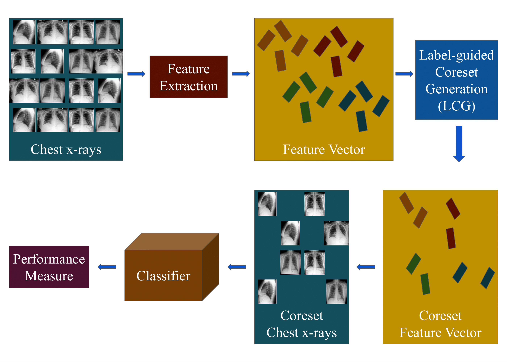

# LABEL-GUIDED CORESET GENERATION FOR COMPUTATIONALLY EFFICIENT CHEST X-RAY DIAGNOSIS
This is the official PyTorch implementation for the LCG method.

[Paper](#) | [Model](#model) | [Data](#data) 
**Label-Guided Coreset Generation for Computationally Efficient Chest X-ray Diagnosis** 
by **Jayant Mahawar**, Bhargab Chattopadhyay, Angshuman Paul 

   
  <em>Fig: A block diagram of the proposed method for chest x-ray diagnosis consisting of feature extraction, coreset generation, and classification modules.</em>

<be> 

## Explanation
The method follows a three-stage approach to demonstrate our model's utility. The first stage, feature generation, extracts meaningful features from the image data. The second stage employs the LCG algorithm to generate the coreset. The third stage involves a classification task to validate the usefulness of the generated coreset. In the first stage, we define a lightweight autoencoder model to extract visual features from image data, using only two convolutional layers to generate the feature map. This design reduces the computational load required to train the autoencoder. We then add a few linear layers to further reduce the dimensionality of the feature vector. Feature extraction is necessary because our model operates in the feature space rather than the image space. In higher dimensions, distance metrics can be misleading due to their sensitivity to noise.

In the second stage, we start with an empty coreset and iteratively add data points, utilizing clusters corresponding to different class labels. The first data point is always included in the coreset as there are no existing points for comparison. 
Suppose, after iteration ($u$), we have ($m_u$) samples in our coreset ($\zeta$). Also, consider that we have data from $l$ number of classes in the coreset. We look into the clusters formed by data points from each of the $l$ classes. Now, assume that we have a data point $x_i$. We need to decide if $x_i$ should be included in the coreset or not. For that, we first calculate the Mahalanobis distance of $x_i$ from the center of the coreset $Z_u$:
$$D_M(Z_u, x_i, \nu) = \frac{\exp(\nu)}{2} (Z_u - x_i)^T (Z_u - x_i),$$
where $\nu$ is the value of the largest dimension in the feature vector among all the data points in the coreset.

Subsequently, we consider the fact that if the distance between $x_i$ and the coreset center is large, $x_i$ may provide some new information that does not already exist in the coreset. Hence, $x_i$ should have a high probability of being included in the coreset if it lies away from the coreset center. Based on this, the initial probability that $x_i$ belongs to the coreset is calculated as:
$$ p_i = \min \left\{1, \theta \left(\frac{2 D_M(Z_u, x_i, \nu)}{\mu S} + \frac{8}{\mu (u-1)}\right) \right\},$$
where $\theta$ is the hyperparameter, $S$ is the cumulative sum of Mahalanobis distances between the coreset center ($Z_u$) and all the data points in the coreset at present.

Next, we examine the clusters corresponding to different class labels in the coreset. Each data point in our dataset can contain multiple class labels. Suppose data point $x_i$ has several class labels and one of them is $y_i(j)$. If there is no data point from class $y_i(j)$ in the coreset so far and $p_i$ is high, $x_i$ should be included in the coreset. If a data point containing class label $y_i(j)$ already exists in the coreset and $x_i$ lies close to the cluster center of class label $y_i(j)$, $x_i$ may not provide new information about class $y_i(j)$. Thus, the final probability of including $x_i$ in the coreset should be low. Conversely, if $x_i$ lies far away from the cluster center of class $y_i(j)$, $x_i$ should have a high probability of being included in the coreset.

We compute the Euclidean distance between the data point $x_i$ and the cluster center of class $y_i(j)$. Let this distance be $d_j(x_i)$. We also compute the distance of all existing data points belonging to class $y_i(j)$ from the cluster center of class $y_i(j)$. Let the mean and standard deviation of these distances be $\overline{D(y_i(j))}$ and $\sigma(D(y_i(j)))$, respectively. We calculate a threshold:
$$\Delta(y_i(j)) = \overline{D(y_i(j))} + k\sigma(D(y_i(j))),$$
where $k$ is a hyperparameter. In our experiments, each data point can contain multiple class labels. The data point $x_i$ is included in the coreset if and only if $d_j(x_i) \geq \Delta(y_i(j))$ for all the class labels that are present in $x_i$. Thus, in the coreset, we include only those data points that are sufficiently far from their corresponding cluster centers.

## Requirements: 
1. Python 3.8.  
2. PyTorch 2.0.  

## Release Notes
This repository is a faithful reimplementation of LCG in PyTorch, including all the training and evaluation codes on Vinbig Chest X-ray dataset.
